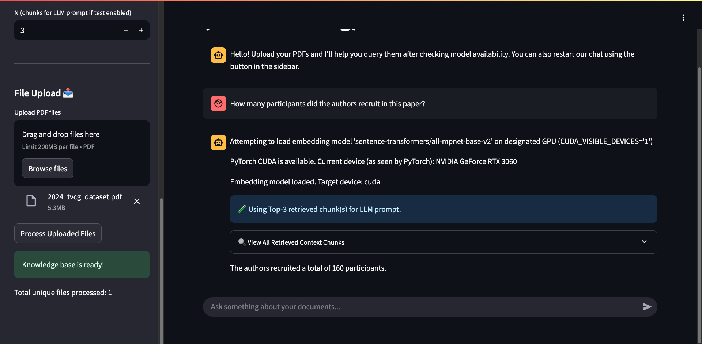

# Ollama RAG PDF Chat

Chat with your PDF documents using Retrieval-Augmented Generation (RAG) and open-source LLMs via Ollama. This app uses Streamlit for the UI and supports any Ollama-compatible model.

<!-- Add screenshots of the app below. Example: -->


## Features
- Upload and process PDF files
- Query your documents using RAG and LLMs
- Model-agnostic: works with any open-source model available in Ollama
- GPU selection for both Ollama and embedding models
- Easy-to-use Streamlit interface

## Prerequisites
- Python 3.8+
- Docker (for running Ollama)

## Getting Started

### 1. Deploy Ollama with Docker

Pull and run the Ollama Docker container:

```bash
docker run -d --gpus all -p 11434:11434 --name ollama ollama/ollama
```

This exposes Ollama's API at `http://localhost:11434` and enables GPU support.

### 2. Install Python Dependencies

```bash
pip install -r requirements.txt
```

### 3. Run the Streamlit App

```bash
streamlit run app.py
```

### 4. Upload PDFs and Start Chatting
- Use the sidebar to upload PDF files.
- Ask questions about your documents using the chat interface.

## Configuration
- The model used for LLM queries is set by the `LLM_MODEL_NAME` variable in `app.py`.
- GPU selection for embedding models is managed via `CUDA_VISIBLE_DEVICES` in `app.py`.
- Ollama's GPU selection is managed by Docker (`--gpus all`) and your system's CUDA configuration.

## Example Models
- Llama 3
- DeepSeek
- Gemma
- Any other open-source model supported by Ollama


## Troubleshooting
- Ensure Docker is running and Ollama is accessible at `http://localhost:11434`.
- Check GPU availability and CUDA configuration if you want to use GPUs.
- For model management, use Ollama's CLI or API to pull and list models.

## Tips for Tuning RAG Parameters
- **Chunk Size**: Larger chunks may capture more context but can reduce retrieval granularity. Smaller chunks improve retrieval accuracy but may split relevant information.
- **Chunk Overlap**: Increasing overlap helps preserve context between chunks, especially for long sentences or paragraphs split across boundaries.
- **Chunks to Retrieve (`k`)**: Higher values provide more context to the LLM but may introduce irrelevant information. Tune based on your document size and query specificity.
- **LLM Temperature**: Lower values make responses more focused and deterministic; higher values increase creativity and variability.
- All these parameters can be adjusted in the Streamlit sidebar for immediate experimentation.

## License
Apache License 2.0. See the LICENSE file for details.


## Acknowledgements
- [Ollama](https://ollama.com/)
- [Streamlit](https://streamlit.io/)
- [LangChain](https://python.langchain.com/)
- [FAISS](https://github.com/facebookresearch/faiss)
